# 🚌 RedBus Clone – Production-Grade DevOps & Kubernetes Project

<p align="center">
  
  
  
  
  
  
  
</p>

---

## 📖 Table of Contents

- [Project Overview](#-project-overview)
- [Architecture](#-architecture)
  - [High-Level System Architecture](#1-high-level-system-architecture)
  - [CI/CD Pipeline Architecture](#2-cicd-pipeline-architecture-jenkins)
  - [Kubernetes Cluster Architecture](#3-kubernetes-cluster-architecture)
  - [Infrastructure Provisioning (Terraform)](#4-infrastructure-provisioning-terraform)
  - [Monitoring & Observability](#5-monitoring--observability-architecture)
  - [Application Architecture](#6-application-architecture-react--nodejs)
  - [Docker Build Architecture](#7-docker-build-architecture)
- [Tech Stack](#-tech-stack)
- [Project Structure](#-project-structure)
- [Prerequisites](#-prerequisites)
- [Local Development Setup](#-local-development-setup)
- [Docker Setup](#-docker-setup)
- [CI/CD Pipeline](#-cicd-pipeline)
- [Kubernetes Deployment](#-kubernetes-deployment)
- [Infrastructure as Code (Terraform)](#-infrastructure-as-code-terraform)
- [Monitoring & Observability](#-monitoring--observability)
- [Security Scanning](#-security-scanning)
- [API Endpoints](#-api-endpoints)
- [Environment Variables](#-environment-variables)
- [Troubleshooting](#-troubleshooting)
- [Contributing](#-contributing)
- [License](#-license)

---

## 📌 Project Overview

**RedBus Clone** is a **full-stack bus ticket booking application** that demonstrates a complete **production-ready DevOps implementation**. The project showcases:

- ✅ **Microservices Architecture** – Separate frontend and backend services
- ✅ **Containerization** – Docker multi-stage builds for optimized images
- ✅ **CI/CD Automation** – Jenkins pipeline with 11+ stages
- ✅ **Kubernetes Orchestration** – AWS EKS deployment with auto-scaling
- ✅ **Infrastructure as Code** – Terraform for AWS resource provisioning
- ✅ **Security Scanning** – Trivy, OWASP Dependency Check, SonarQube
- ✅ **Monitoring** – Prometheus & Grafana dashboards

### 🎯 Key Objectives

| Objective | Technology |
|-----------|------------|
| Build full-stack application | React, Node.js, Express, MongoDB |
| Containerize services | Docker, Nginx |
| Automate CI/CD | Jenkins, SonarQube, OWASP |
| Deploy to cloud | AWS EKS, Kubernetes |
| Provision infrastructure | Terraform |
| Implement security | Trivy, OWASP Dependency Check |
| Monitor application | Prometheus, Grafana |

---

## 🏗 Architecture

<!--  -->

### 1. High-Level System Architecture

```mermaid
flowchart TB
    subgraph Users["🌐 Users"]
        Browser["🖥️ Browser"]
    end

    subgraph DNS["DNS & TLS"]
        Route53["Amazon Route 53\nredbus.yourdomain.com"]
        ACM["AWS ACM\n(TLS Certificate)"]
    end

    subgraph AWS["☁️ AWS Cloud (us-east-1)"]
        subgraph VPC["VPC – redbus-vpc"]
            subgraph PubSubnet["Public Subnets"]
                NATGateway["NAT Gateway"]
                ALB["Application Load Balancer\n(Ingress Controller)"]
            end

            subgraph EKS["Amazon EKS – redbus-cluster"]
                subgraph NS_Redbus["Namespace: redbus"]
                    Ingress["Nginx Ingress\n(path-based routing)"]
                    FE["Frontend Deployment\n(React + Nginx)\nReplicas: 2\nPort: 80"]
                    BE["Backend Deployment\n(Node.js + Express)\nReplicas: 2\nPort: 5000"]
                    ConfigMap["ConfigMap\n(redbus-config)"]
                    Secrets["K8s Secrets\n(MongoDB URI, Stripe Key)"]
                    FE_SVC["frontend-service\nClusterIP :80"]
                    BE_SVC["backend-service\nClusterIP :5000"]
                end

                subgraph NS_Monitor["Namespace: monitoring"]
                    Prometheus["Prometheus\n:9090"]
                    Grafana["Grafana\n:3000"]
                    NodeExp["Node Exporter"]
                    KSM["Kube State Metrics"]
                end
            end

            subgraph PrivSubnet["Private Subnets"]
                NodeGroup["EKS Managed Node Group\n(redbus-nodes)"]
            end
        end

        subgraph Storage["Data & Registry"]
            ECR_FE["ECR\nredbus-frontend"]
            ECR_BE["ECR\nredbus-backend"]
            MongoDB["MongoDB Atlas\n(External)"]
            S3["S3 Bucket\n(Terraform State)"]
        end
    end

    subgraph Payments["💳 External Services"]
        Stripe["Stripe API\n(Payment Processing)"]
    end

    Browser -->|"HTTPS"| Route53
    Route53 --> ALB
    ACM -.->|"TLS Termination"| ALB
    ALB --> Ingress
    Ingress -->|"path: /"| FE_SVC
    Ingress -->|"path: /api"| BE_SVC
    FE_SVC --> FE
    BE_SVC --> BE
    ConfigMap -.-> FE
    ConfigMap -.-> BE
    Secrets -.-> BE
    BE -->|"MongoDB Driver"| MongoDB
    BE -->|"Stripe SDK"| Stripe
    FE -->|"API Calls /api/*"| BE_SVC
    NodeGroup --- EKS
    NATGateway --> PrivSubnet
    ECR_FE -.->|"Pull Image"| FE
    ECR_BE -.->|"Pull Image"| BE
    NodeExp --> Prometheus
    KSM --> Prometheus
    Prometheus --> Grafana

    classDef aws fill:#FF9900,stroke:#232F3E,color:#232F3E,stroke-width:2px
    classDef k8s fill:#326CE5,stroke:#fff,color:#fff,stroke-width:2px
    classDef app fill:#68BC71,stroke:#2d6a31,color:#fff,stroke-width:2px
    classDef monitor fill:#E6522C,stroke:#fff,color:#fff,stroke-width:2px
    classDef external fill:#6C63FF,stroke:#fff,color:#fff,stroke-width:2px
    classDef user fill:#36A2EB,stroke:#fff,color:#fff,stroke-width:2px

    class Route53,ACM,NATGateway,ALB,ECR_FE,ECR_BE,S3 aws
    class Ingress,ConfigMap,Secrets,FE_SVC,BE_SVC,NodeGroup k8s
    class FE,BE app
    class Prometheus,Grafana,NodeExp,KSM monitor
    class MongoDB,Stripe external
    class Browser user
```



### 2. CI/CD Pipeline Architecture (Jenkins)

```mermaid
flowchart LR
    subgraph Trigger["🔔 Trigger"]
        GitPush["Git Push /\nWebhook"]
    end

    subgraph Jenkins["🔧 Jenkins Pipeline (11 Stages)"]
        direction TB
        S1["1️⃣ Clean\nWorkspace"]
        S2["2️⃣ Setup ECR\nRegistry"]
        S3["3️⃣ Ensure ECR\nRepositories"]
        S4["4️⃣ Checkout\nSource Code"]

        subgraph Parallel1["⚡ Parallel"]
            S5a["5a. Frontend\nDependencies"]
            S5b["5b. Backend\nDependencies"]
        end

        subgraph Parallel2["⚡ Parallel"]
            S6a["6a. Frontend\nTests"]
            S6b["6b. Backend\nTests"]
        end

        S7["7️⃣ SonarQube\nAnalysis"]
        S8["8️⃣ Quality\nGate Check"]

        subgraph Security["🔒 Security Scanning"]
            S9["9a. OWASP\nDependency Check"]
            S10["9b. Trivy FS\nSecurity Scan"]
        end

        subgraph Parallel3["⚡ Parallel"]
            S11a["🐳 Build Frontend\nDocker Image"]
            S11b["🐳 Build Backend\nDocker Image"]
        end

        subgraph Parallel4["⚡ Parallel"]
            S12a["🔍 Trivy Scan\nFrontend Image"]
            S12b["🔍 Trivy Scan\nBackend Image"]
        end

        S13["📤 Push Images\nto ECR"]
        S14["🚀 Deploy to\nKubernetes (EKS)"]
    end

    subgraph Notify["📬 Notifications"]
        Email["Email\nNotification"]
        Reports["Archive\nReports"]
    end

    GitPush --> S1 --> S2 --> S3 --> S4
    S4 --> Parallel1 --> Parallel2
    Parallel2 --> S7 --> S8
    S8 --> Security --> Parallel3
    Parallel3 --> Parallel4 --> S13 --> S14
    S14 --> Notify

    classDef trigger fill:#6C63FF,stroke:#fff,color:#fff,stroke-width:2px
    classDef stage fill:#326CE5,stroke:#fff,color:#fff,stroke-width:2px
    classDef security fill:#E53935,stroke:#fff,color:#fff,stroke-width:2px
    classDef parallel fill:#FF9800,stroke:#fff,color:#fff,stroke-width:2px
    classDef notify fill:#4CAF50,stroke:#fff,color:#fff,stroke-width:2px

    class GitPush trigger
    class S1,S2,S3,S4,S7,S8,S13,S14 stage
    class S9,S10 security
    class S5a,S5b,S6a,S6b,S11a,S11b,S12a,S12b parallel
    class Email,Reports notify
```



### 3. Kubernetes Cluster Architecture

```mermaid
flowchart TB
    subgraph Internet["🌐 Internet"]
        Client["Client Browser"]
    end

    subgraph EKSCluster["⎈ Amazon EKS Cluster (redbus-cluster)"]
        subgraph IngressLayer["Ingress Layer"]
            IC["Nginx Ingress Controller\n+ TLS (Let's Encrypt)"]
        end

        subgraph Redbus_NS["📦 Namespace: redbus"]
            subgraph FrontendPods["Frontend Pods (Replicas: 2)"]
                FE1["frontend-deployment\nReact + Nginx\nPort: 80\nCPU: 100m-200m\nMem: 128Mi-256Mi"]
            end

            subgraph BackendPods["Backend Pods (Replicas: 2)"]
                BE1["backend-deployment\nNode.js + Express\nPort: 5000\nCPU: 200m-500m\nMem: 256Mi-512Mi"]
            end

            FE_Service["frontend-service\nClusterIP → :80"]
            BE_Service["backend-service\nClusterIP → :5000"]

            CM["📋 ConfigMap\nredbus-config"]
            SEC["🔐 Secrets\nmongodb-uri\nstripe-secret-key"]
        end

        subgraph Monitor_NS["📊 Namespace: monitoring"]
            PROM["Prometheus\nClusterIP :9090\n+ RBAC"]
            GRAF["Grafana\n:3000\n+ Dashboard JSON"]
            NE["Node Exporter\n(DaemonSet)"]
            KSM2["Kube State Metrics\n(Deployment)"]
        end

        subgraph NodeGrp["🖥️ EKS Managed Node Group"]
            N1["Worker Node 1"]
            N2["Worker Node 2"]
        end
    end

    subgraph External["☁️ External"]
        MONGO["MongoDB Atlas"]
        STRIPE["Stripe API"]
        ECR["AWS ECR\n(Image Registry)"]
    end

    Client -->|"HTTPS :443"| IC
    IC -->|"/ → :80"| FE_Service
    IC -->|"/api → :5000"| BE_Service
    FE_Service --> FE1
    BE_Service --> BE1
    CM -.->|"env vars"| FE1
    CM -.->|"env vars"| BE1
    SEC -.->|"secrets"| BE1
    BE1 -->|":27017"| MONGO
    BE1 -->|"HTTPS"| STRIPE
    ECR -.->|"Pull"| FE1
    ECR -.->|"Pull"| BE1
    FE1 --- N1
    BE1 --- N2
    NE --> PROM
    KSM2 --> PROM
    BE1 -.->|"metrics :5000"| PROM
    FE1 -.->|"metrics :80"| PROM
    PROM --> GRAF

    classDef ingress fill:#F06292,stroke:#fff,color:#fff,stroke-width:2px
    classDef frontend fill:#42A5F5,stroke:#fff,color:#fff,stroke-width:2px
    classDef backend fill:#66BB6A,stroke:#fff,color:#fff,stroke-width:2px
    classDef config fill:#FFA726,stroke:#fff,color:#000,stroke-width:2px
    classDef monitoring fill:#EF5350,stroke:#fff,color:#fff,stroke-width:2px
    classDef external fill:#AB47BC,stroke:#fff,color:#fff,stroke-width:2px
    classDef node fill:#78909C,stroke:#fff,color:#fff,stroke-width:2px

    class IC ingress
    class FE1,FE_Service frontend
    class BE1,BE_Service backend
    class CM,SEC config
    class PROM,GRAF,NE,KSM2 monitoring
    class MONGO,STRIPE,ECR external
    class N1,N2 node
```



### 4. Infrastructure Provisioning (Terraform)

```mermaid
flowchart TB
    subgraph TF["🟣 Terraform IaC"]
        TFState["S3 Backend\n(Remote State +\nDynamoDB Lock)"]
        Provider["AWS Provider\nus-east-1"]
    end

    subgraph VPC_Module["🔵 VPC Module"]
        VPC["VPC\nredbus-vpc\nCIDR: configurable"]
        PubSub["Public Subnets\n(2 AZs)\nTagged: kubernetes.io/role/elb"]
        PrivSub["Private Subnets\n(2 AZs)\nTagged: internal-elb"]
        NAT["NAT Gateway"]
        IGW["Internet Gateway"]
        DNS["DNS Hostnames\n+ Support Enabled"]
    end

    subgraph EKS_Module["🔵 EKS Module"]
        Cluster["EKS Cluster\nredbus-cluster\nPublic + Private Endpoint"]
        NodeGrp2["Managed Node Group\nredbus-nodes\nON_DEMAND"]
        RBAC2["Cluster Creator\nAdmin Permissions"]
    end

    subgraph ECR_Resources["🟢 ECR Repositories"]
        ECR_F["redbus-frontend\n(Scan on Push)"]
        ECR_B["redbus-backend\n(Scan on Push)"]
    end

    subgraph Outputs["📤 Outputs"]
        O1["cluster_endpoint"]
        O2["cluster_name"]
        O3["ecr_frontend_url"]
        O4["ecr_backend_url"]
        O5["vpc_id"]
    end

    TF --> Provider
    TFState -.-> TF
    Provider --> VPC_Module
    Provider --> EKS_Module
    Provider --> ECR_Resources
    VPC --> PubSub
    VPC --> PrivSub
    VPC --> NAT
    VPC --> IGW
    VPC --> DNS
    PubSub --> EKS_Module
    PrivSub --> EKS_Module
    Cluster --> NodeGrp2
    Cluster --> RBAC2
    EKS_Module --> Outputs
    ECR_Resources --> Outputs

    classDef tf fill:#7B42BC,stroke:#fff,color:#fff,stroke-width:2px
    classDef vpc fill:#1976D2,stroke:#fff,color:#fff,stroke-width:2px
    classDef eks fill:#326CE5,stroke:#fff,color:#fff,stroke-width:2px
    classDef ecr fill:#FF9900,stroke:#232F3E,color:#232F3E,stroke-width:2px
    classDef output fill:#4CAF50,stroke:#fff,color:#fff,stroke-width:2px

    class TFState,Provider tf
    class VPC,PubSub,PrivSub,NAT,IGW,DNS vpc
    class Cluster,NodeGrp2,RBAC2 eks
    class ECR_F,ECR_B ecr
    class O1,O2,O3,O4,O5 output
```



### 5. Monitoring & Observability Architecture

```mermaid
flowchart LR
    subgraph Targets["📡 Metric Sources"]
        App_BE["Backend Pods\n(Node.js :5000)"]
        App_FE["Frontend Pods\n(Nginx :80)"]
        NE2["Node Exporter\n(DaemonSet)\nHost Metrics"]
        KSM3["Kube State Metrics\nK8s Object Metrics"]
        PROM_SELF["Prometheus\nSelf-Monitoring\n:9090"]
    end

    subgraph Prometheus_Stack["📊 Prometheus"]
        PROM2["Prometheus Server\nScrape Interval: 15s\nCluster: redbus-cluster"]
        SD["Kubernetes\nService Discovery\n(Pod Role)"]
        Relabel["Relabel Configs\nFilter by:\n- app label\n- port number\n- namespace"]
        RBAC3["RBAC\nClusterRole\n+ ServiceAccount"]
    end

    subgraph Grafana_Stack["📈 Grafana"]
        GRAF2["Grafana Server\n:3000"]
        DS["Datasource:\nPrometheus"]
        Dash["Dashboard\n(JSON Provisioned)"]
    end

    subgraph Alerts["🔔 Alerting"]
        AM["Alertmanager\n(Optional :9093)"]
    end

    App_BE -->|"metrics"| SD
    App_FE -->|"metrics"| SD
    NE2 -->|"metrics"| SD
    KSM3 -->|"metrics"| SD
    PROM_SELF -->|"metrics"| SD
    SD --> Relabel --> PROM2
    RBAC3 -.-> PROM2
    PROM2 --> GRAF2
    PROM2 -.-> AM
    GRAF2 --> DS --> Dash

    classDef source fill:#29B6F6,stroke:#fff,color:#fff,stroke-width:2px
    classDef prom fill:#E65100,stroke:#fff,color:#fff,stroke-width:2px
    classDef grafana fill:#F9A825,stroke:#000,color:#000,stroke-width:2px
    classDef alert fill:#E53935,stroke:#fff,color:#fff,stroke-width:2px

    class App_BE,App_FE,NE2,KSM3,PROM_SELF source
    class PROM2,SD,Relabel,RBAC3 prom
    class GRAF2,DS,Dash grafana
    class AM alert
```



### 6. Application Architecture (React + Node.js)

```mermaid
flowchart TB
    subgraph Frontend["⚛️ React Frontend (Port 80)"]
        direction TB
        Nginx["Nginx\n(Reverse Proxy + Static)"]
        subgraph ReactApp["React App"]
            Router["React Router\n(Routes.jsx)"]
            Redux["Redux Store\n+ Thunk Middleware"]
            subgraph Pages["Pages / Components"]
                LP["Landing Page"]
                SB["Select Bus"]
                BD["Bus Details\n+ Seat Selection"]
                PP["Payment Page\n(Stripe)"]
                PF["Profile Page"]
                BH["Bus Hire"]
                NV["Navbar"]
            end
            subgraph ReduxSlices["Redux Slices"]
                AuthSlice["auth/"]
                BookSlice["BookBus/"]
                BusSlice["busService/"]
                FilterSlice["FilterAndSort/"]
                RouteSlice["routes/"]
            end
        end
    end

    subgraph Backend["🟢 Node.js Backend (Port 5000)"]
        direction TB
        Express["Express.js Server\n(app.js)"]
        subgraph API_Routes["API Routes"]
            R_Booking["/api/booking"]
            R_BookHire["/api/bookinghire"]
            R_Bus["/api/bus"]
            R_BusSvc["/api/busservice"]
            R_Customer["/api/customer"]
            R_Route["/api/route"]
        end
        subgraph Controllers["Controllers"]
            C_Booking["booking.js"]
            C_BookHire["bookingHire.js"]
            C_Bus["bus.js"]
            C_BusSvc["busservice.js"]
            C_Customer["customer.js"]
            C_Route["route.js"]
        end
        subgraph Models["Mongoose Models"]
            M_Booking["Booking"]
            M_BookHire["BookingHire"]
            M_Bus["Bus"]
            M_BusSvc["BusService"]
            M_Customer["Customer"]
            M_Route["Route"]
        end
    end

    subgraph ExternalSvcs["☁️ External Services"]
        MongoDB2["MongoDB Atlas"]
        StripeAPI["Stripe API"]
    end

    Nginx --> Router
    Router --> Pages
    Pages --> Redux
    Redux --> ReduxSlices
    ReduxSlices -->|"HTTP /api/*"| Express
    Express --> API_Routes
    R_Booking --> C_Booking
    R_BookHire --> C_BookHire
    R_Bus --> C_Bus
    R_BusSvc --> C_BusSvc
    R_Customer --> C_Customer
    R_Route --> C_Route
    C_Booking --> M_Booking
    C_BookHire --> M_BookHire
    C_Bus --> M_Bus
    C_BusSvc --> M_BusSvc
    C_Customer --> M_Customer
    C_Route --> M_Route
    Models --> MongoDB2
    C_Booking -.-> StripeAPI

    classDef fe fill:#61DAFB,stroke:#222,color:#222,stroke-width:2px
    classDef be fill:#68A063,stroke:#fff,color:#fff,stroke-width:2px
    classDef ext fill:#FF6F00,stroke:#fff,color:#fff,stroke-width:2px
    classDef redux fill:#764ABC,stroke:#fff,color:#fff,stroke-width:2px

    class Nginx,Router,LP,SB,BD,PP,PF,BH,NV fe
    class Express,R_Booking,R_BookHire,R_Bus,R_BusSvc,R_Customer,R_Route,C_Booking,C_BookHire,C_Bus,C_BusSvc,C_Customer,C_Route,M_Booking,M_BookHire,M_Bus,M_BusSvc,M_Customer,M_Route be
    class MongoDB2,StripeAPI ext
    class Redux,AuthSlice,BookSlice,BusSlice,FilterSlice,RouteSlice redux
```



### 7. Docker Build Architecture

```mermaid
flowchart LR
    subgraph FE_Build["🐳 Frontend – Multi-Stage Build"]
        FE_S1["Stage 1: Builder\nnode:18-alpine\nnpm install\nnpm run build"]
        FE_S2["Stage 2: Production\nnginx:alpine\nCopy build artifacts\n+ nginx.conf"]
        FE_S1 -->|"COPY --from=builder\n/app/build"| FE_S2
    end

    subgraph BE_Build["🐳 Backend – Single Stage"]
        BE_S1["node:18-alpine\napk upgrade (CVE fix)\nCreate non-root user\nnpm ci --only=production\nRun as nodeuser"]
    end

    subgraph Security["🔒 Security Features"]
        HC["Health Checks\n(30s interval)"]
        NR["Non-Root User\n(Backend)"]
        MS["Multi-Stage Build\n(Smaller Image)"]
        CVE["Alpine CVE Patches"]
    end

    subgraph Registry["📦 AWS ECR"]
        ECR_FE2["redbus-frontend\n:latest / :BUILD_NUM"]
        ECR_BE2["redbus-backend\n:latest / :BUILD_NUM"]
    end

    FE_S2 -->|"docker push"| ECR_FE2
    BE_S1 -->|"docker push"| ECR_BE2
    HC -.-> FE_S2
    HC -.-> BE_S1
    NR -.-> BE_S1
    MS -.-> FE_S2
    CVE -.-> BE_S1

    classDef build fill:#2196F3,stroke:#fff,color:#fff,stroke-width:2px
    classDef sec fill:#F44336,stroke:#fff,color:#fff,stroke-width:2px
    classDef reg fill:#FF9800,stroke:#fff,color:#fff,stroke-width:2px

    class FE_S1,FE_S2,BE_S1 build
    class HC,NR,MS,CVE sec
    class ECR_FE2,ECR_BE2 reg
```



---

## 🛠 Tech Stack

### Application

| Layer | Technology | Version |
|-------|------------|---------|
| Frontend | React.js | 17.0.1 |
| UI Library | Material-UI | 4.11.3 |
| State Management | Redux + Thunk | 4.0.5 |
| Backend | Node.js + Express | 18+ / 4.17.1 |
| Database | MongoDB | 5.0+ |
| Payment | Stripe | 8.138.0 |

### DevOps & Infrastructure

| Tool | Purpose |
|------|---------|
| Docker | Containerization |
| Kubernetes | Container Orchestration |
| AWS EKS | Managed Kubernetes |
| Terraform | Infrastructure as Code |
| Jenkins | CI/CD Pipeline |
| SonarQube | Code Quality Analysis |
| Trivy | Container Security Scanning |
| OWASP DC | Dependency Vulnerability Check |
| Prometheus | Metrics Collection |
| Grafana | Visualization & Dashboards |

---

## 📁 Project Structure

```bash
redbus-devops/
│
├── 📄 README.md                      # Project documentation (this file)
├── 📄 .gitignore                     # Git ignore rules
├── 📄 Jenkinsfile                    # CI/CD pipeline definition
│
├── 📁 docker/                        # Docker configuration
│   ├── frontend.Dockerfile           # React multi-stage build
│   ├── backend.Dockerfile            # Node.js optimized build
│   └── nginx.conf                    # Nginx production config
│
├── 📁 infra/                         # Infrastructure as Code
│   ├── 📁 kubernetes/                # K8s manifests
│   │   ├── namespace.yml             # Namespace definition
│   │   ├── configmap.yml             # Environment configs
│   │   ├── frontend-deployment.yml   # Frontend deployment
│   │   ├── frontend-service.yml      # Frontend service
│   │   ├── backend-deployment.yml    # Backend deployment
│   │   ├── backend-service.yml       # Backend service
│   │   ├── ingress.yml               # Ingress controller
│   │   └── 📁 monitoring/            # Monitoring stack
│   │       ├── namespace.yml         # Monitoring namespace
│   │       ├── prometheus-rbac.yml   # Prometheus RBAC
│   │       ├── prometheus-configmap.yml
│   │       ├── prometheus-deployment.yml
│   │       ├── grafana-configmap.yml
│   │       ├── grafana-deployment.yml
│   │       ├── node-exporter.yml     # Node metrics
│   │       └── kube-state-metrics.yml
│   │
│   └── 📁 terraform/                 # Terraform AWS setup
│       ├── provider.tf               # AWS provider config
│       ├── main.tf                   # EKS, VPC, ECR resources
│       ├── variables.tf              # Input variables
│       ├── outputs.tf                # Output values
│       └── backend.tf                # S3 remote state
│
├── 📁 monitoring/                    # Observability configs
│   ├── prometheus.yml                # Prometheus scrape config
│   └── grafana-dashboard.json        # Grafana dashboard
│
├── 📁 scripts/                       # Automation scripts
│   ├── 📁 aws/
│   │   ├── awscli.sh                 # AWS CLI installation
│   │   ├── eksctl.sh                 # eksctl installation
│   │   └── kubectl.sh                # kubectl installation
│   ├── 📁 devops/
│   │   ├── docker.sh                 # Docker installation
│   │   ├── jenkins.sh                # Jenkins installation
│   │   └── terraform.sh              # Terraform installation
│   └── 📁 monitoring/
│       ├── deploy-monitoring.sh      # Deploy monitoring to K8s
│       ├── grafana.sh                # Grafana + Prometheus setup
│       └── trivy.sh                  # Trivy scanner installation
│
├── 📁 back-end-redbus/               # Backend application
│   ├── app.js                        # Express server entry
│   ├── config.env                    # Environment variables
│   ├── package.json                  # Dependencies
│   ├── 📁 controllers/               # Route handlers
│   │   ├── booking.js
│   │   ├── bookingHire.js
│   │   ├── bus.js
│   │   ├── busservice.js
│   │   ├── customer.js
│   │   └── route.js
│   ├── 📁 models/                    # MongoDB schemas
│   │   ├── booking.js
│   │   ├── bookingHire.js
│   │   ├── bus.js
│   │   ├── busservice.js
│   │   ├── customer.js
│   │   └── route.js
│   └── 📁 routes/                    # API routes
│       ├── booking.js
│       ├── bookinghire.js
│       ├── bus.js
│       ├── busservice.js
│       ├── customer.js
│       └── route.js
│
└── 📁 front-end-redbus/              # Frontend application
    ├── package.json                  # Dependencies
    ├── .env                          # Environment variables
    ├── 📁 public/                    # Static assets
    │   ├── index.html
    │   ├── favicon.ico
    │   └── manifest.json
    └── 📁 src/                       # Source code
        ├── App.js                    # Root component
        ├── index.js                  # Entry point
        ├── index.css                 # Global styles
        ├── 📁 Components/            # React components
        │   ├── LandingPage/
        │   ├── Navbar/
        │   ├── SelectBus/
        │   ├── BusDetails/
        │   ├── Payment Page/
        │   ├── Profile Page/
        │   └── ...
        ├── 📁 Redux/                 # State management
        │   ├── store.js
        │   ├── auth/
        │   ├── BookBus/
        │   └── ...
        └── 📁 Routes/                # App routing
            └── Routes.jsx
```

---

## 📋 Prerequisites

### Required Software

| Software | Version | Purpose |
|----------|---------|---------|
| Node.js | 18+ | JavaScript runtime |
| npm | 8+ | Package manager |
| Docker | 20+ | Containerization |
| kubectl | 1.28+ | Kubernetes CLI |
| AWS CLI | 2.0+ | AWS management |
| Terraform | 1.6+ | IaC tool |
| Git | 2.0+ | Version control |

### AWS Requirements

- AWS Account with admin access
- IAM user with programmatic access
- Configured AWS CLI (`aws configure`)

### Jenkins Plugins Required

- Pipeline
- Git
- Docker Pipeline
- NodeJS
- SonarQube Scanner
- OWASP Dependency-Check
- Email Extension
- Amazon Web Services SDK
- Kubernetes CLI

---

## 🚀 Local Development Setup

### 1. Clone the Repository

```bash
git clone https://github.com/yourusername/redbus-devops.git
cd redbus-devops
```

### 2. Backend Setup

```bash
# Navigate to backend
cd back-end-redbus

# Install dependencies
npm install

# Create environment file
cp config.env.example config.env

# Edit config.env with your MongoDB URI
# MONGODB_URI=<YOUR_MONGODB_URI>

# Start backend server
npm start

# Server runs on http://localhost:5000
```

### 3. Frontend Setup

```bash
# Navigate to frontend (new terminal)
cd front-end-redbus

# Install dependencies
npm install

# Create environment file
echo "REACT_APP_BACKEND_URL=http://localhost:5000" > .env

# Start development server
npm start

# App runs on http://localhost:3000
```

### 4. Verify Setup

- Frontend: http://localhost:3000
- Backend API: http://localhost:5000/v1/api/buses

---

## 🐳 Docker Setup

### Build Images Locally

```bash
# Build backend image
docker build -f docker/backend.Dockerfile -t redbus-backend:local ./back-end-redbus

# Build frontend image
docker build -f docker/frontend.Dockerfile -t redbus-frontend:local ./front-end-redbus
```

### Run with Docker Compose

```bash
# Create docker-compose.yml (if not exists)
cat > docker-compose.yml << 'EOF'
version: '3.8'

services:
  backend:
    build:
      context: ./back-end-redbus
      dockerfile: ../docker/backend.Dockerfile
    ports:
      - "5000:5000"
    environment:
      - MONGODB_URI=mongodb://mongo:27017/redbus
      - PORT=5000
    depends_on:
      - mongo

  frontend:
    build:
      context: ./front-end-redbus
      dockerfile: ../docker/frontend.Dockerfile
    ports:
      - "3000:80"
    depends_on:
      - backend

  mongo:
    image: mongo:5.0
    ports:
      - "27017:27017"
    volumes:
      - mongo-data:/data/db

volumes:
  mongo-data:
EOF

# Start all services
docker-compose up -d

# View logs
docker-compose logs -f

# Stop services
docker-compose down
```

### Docker Image Details

| Image | Base | Size | Exposed Port |
|-------|------|------|--------------|
| redbus-frontend | nginx:alpine | ~25MB | 80 |
| redbus-backend | node:18-alpine | ~150MB | 5000 |

---

## 🔄 CI/CD Pipeline

### Pipeline Stages

```
┌─────────────────────────────────────────────────────────────────────────────┐
│                         JENKINS PIPELINE FLOW                               │
├─────────────────────────────────────────────────────────────────────────────┤
│                                                                             │
│  1. 📥 CHECKOUT                                                             │
│     └── Clone source code from Git                                          │
│                                                                             │
│  2. 📦 INSTALL DEPENDENCIES (Parallel)                                      │
│     ├── Frontend: npm install                                               │
│     └── Backend: npm install                                                │
│                                                                             │
│  3. 🧪 RUN TESTS (Parallel)                                                 │
│     ├── Frontend: CI=true npm test                                          │
│     └── Backend: npm test                                                   │
│                                                                             │
│  4. 🔍 SONARQUBE ANALYSIS                                                   │
│     └── Code quality, bugs, vulnerabilities, code smells                    │
│                                                                             │
│  5. ⏳ SONARQUBE QUALITY GATE                                               │
│     └── Pass/Fail based on quality thresholds                               │
│                                                                             │
│  6. 🛡️ OWASP DEPENDENCY CHECK                                               │
│     └── Scan for known CVE vulnerabilities                                  │
│                                                                             │
│  7. 🔒 TRIVY FILESYSTEM SCAN                                                │
│     └── Scan source code for secrets & vulnerabilities                      │
│                                                                             │
│  8. 🐳 BUILD DOCKER IMAGES (Parallel)                                       │
│     ├── Frontend image                                                      │
│     └── Backend image                                                       │
│                                                                             │
│  9. 🔍 TRIVY IMAGE SCAN (Parallel)                                          │
│     ├── Scan frontend image (exit-code 1 on CRITICAL)                       │
│     └── Scan backend image (exit-code 1 on CRITICAL)                        │
│                                                                             │
│  10. 📤 PUSH DOCKER IMAGES                                                  │
│      └── Push to Docker registry (ECR/DockerHub)                            │
│                                                                             │
│  11. 🚀 DEPLOY TO KUBERNETES                                                │
│      ├── Create namespace (if not exists)                                   │
│      ├── Apply K8s manifests                                                │
│      ├── Update deployment images                                           │
│      └── Wait for rollout completion                                        │
│                                                                             │
│  12. 📧 EMAIL NOTIFICATION                                                  │
│      ├── ✅ Success: Green email with summary                               │
│      ├── ❌ Failure: Red email with logs                                    │
│      └── ⚠️ Unstable: Yellow warning email                                  │
│                                                                             │
└─────────────────────────────────────────────────────────────────────────────┘
```

### Jenkins Configuration

#### 1. Install Required Plugins

```
Dashboard > Manage Jenkins > Manage Plugins > Available
- Pipeline
- Git
- Docker Pipeline  
- NodeJS
- SonarQube Scanner
- OWASP Dependency-Check
- Email Extension
- Amazon Web Services SDK
```

#### 2. Configure Tools

```
Dashboard > Manage Jenkins > Global Tool Configuration

NodeJS:
  Name: NodeJS-18
  Version: 18.x

SonarQube Scanner:
  Name: SonarQubeScanner
  Install automatically: ✓

OWASP Dependency-Check:
  Name: OWASP-Dependency-Check
  Install automatically: ✓
```

#### 3. Configure Credentials

```
Dashboard > Manage Jenkins > Manage Credentials

Add:
- docker-credentials (Username/Password)
- aws-credentials (AWS Credentials)
- sonar-token (Secret text)
```

#### 4. Configure SonarQube Server

```
Dashboard > Manage Jenkins > Configure System > SonarQube servers

Name: SonarQube
Server URL: http://your-sonarqube-server:9000
Server authentication token: (select sonar-token credential)
```

#### 5. Configure Email

```
Dashboard > Manage Jenkins > Configure System > Extended E-mail Notification

SMTP server: smtp.gmail.com
SMTP port: 465
Use SSL: ✓
Credentials: (your email credentials)
Default recipients: team@example.com
```

### Run Pipeline

```bash
# Create a new pipeline job
Dashboard > New Item > Pipeline

# Configure:
Pipeline script from SCM
  SCM: Git
  Repository URL: https://github.com/yourusername/redbus-devops.git
  Branch: */main
  Script Path: Jenkinsfile

# Build Now
```

---

## ☸️ Kubernetes Deployment

### Manual Deployment

```bash
# Configure kubectl for EKS
aws eks update-kubeconfig --region us-east-1 --name redbus-cluster

# Create namespace
kubectl create namespace redbus

# Apply all manifests
kubectl apply -f infra/kubernetes/ -n redbus

# Verify deployments
kubectl get all -n redbus

# Check pod logs
kubectl logs -f deployment/frontend-deployment -n redbus
kubectl logs -f deployment/backend-deployment -n redbus
```

### Kubernetes Resources

| Resource | Name | Replicas | Port |
|----------|------|----------|------|
| Deployment | frontend-deployment | 2 | 80 |
| Deployment | backend-deployment | 2 | 5000 |
| Service | frontend-service | - | 80 |
| Service | backend-service | - | 5000 |
| Ingress | redbus-ingress | - | 80/443 |
| ConfigMap | redbus-config | - | - |
| Secret | redbus-secrets | - | - |

### Monitoring Resources (monitoring namespace)

| Resource | Name | Type | Port |
|----------|------|------|------|
| Deployment | prometheus | Deployment | 30090 |
| Deployment | grafana | Deployment | 30030 |
| DaemonSet | node-exporter | DaemonSet | 9100 |
| Deployment | kube-state-metrics | Deployment | 8080 |
| ConfigMap | prometheus-config | ConfigMap | - |
| ConfigMap | grafana-datasources | ConfigMap | - |
| ServiceAccount | prometheus | RBAC | - |

### Scaling

```bash
# Scale frontend
kubectl scale deployment frontend-deployment --replicas=5 -n redbus

# Auto-scaling (HPA)
kubectl autoscale deployment backend-deployment --min=2 --max=10 --cpu-percent=70 -n redbus
```

---

## 🏗 Infrastructure as Code (Terraform)

### Initialize & Deploy

```bash
# Navigate to terraform directory
cd infra/terraform

# Initialize Terraform
terraform init

# Preview changes
terraform plan

# Apply infrastructure
terraform apply

# Get outputs
terraform output
```

### Resources Created

| Resource | Description |
|----------|-------------|
| VPC | Virtual Private Cloud (10.0.0.0/16) |
| Subnets | 3 Public + 3 Private subnets |
| NAT Gateway | For private subnet internet access |
| EKS Cluster | Managed Kubernetes cluster |
| Node Group | t3.medium instances (min:1, max:5, desired:2) |
| Kubernetes Version | 1.29 |
| ECR | Container registries for images |
| IAM Roles | EKS cluster and node roles |

### Destroy Infrastructure

```bash
# Destroy all resources (WARNING: This deletes everything!)
terraform destroy
```

---

## 📊 Monitoring & Observability

### Option 1: Deploy Using Project Manifests (Recommended)

This project includes custom Kubernetes manifests for monitoring:

```bash
# Deploy complete monitoring stack using the provided script
chmod +x scripts/monitoring/deploy-monitoring.sh
./scripts/monitoring/deploy-monitoring.sh

# Or manually apply manifests
kubectl apply -f infra/kubernetes/monitoring/
```

**Access URLs (NodePort):**
- Prometheus: `http://<NODE_IP>:30090`
- Grafana: `http://<NODE_IP>:30030`

**Grafana Credentials:**
- Username: `admin`
- Password: `admin123`

### Monitoring Stack Components

| Component | Purpose | Port |
|-----------|---------|------|
| Prometheus | Metrics collection & storage | 30090 |
| Grafana | Visualization & dashboards | 30030 |
| Node Exporter | Host-level metrics | 9100 |
| Kube State Metrics | Kubernetes object metrics | 8080 |

### Option 2: Deploy Using Helm

```bash
# Install Prometheus using Helm
helm repo add prometheus-community https://prometheus-community.github.io/helm-charts
helm repo update

helm install prometheus prometheus-community/prometheus \
  --namespace monitoring \
  --create-namespace \
  --set alertmanager.enabled=false \
  --set pushgateway.enabled=false
```

### Grafana Setup (Helm Alternative)

```bash
# Install Grafana using Helm
helm repo add grafana https://grafana.github.io/helm-charts

helm install grafana grafana/grafana \
  --namespace monitoring \
  --set adminPassword=admin123 \
  --set service.type=LoadBalancer

# Get Grafana password
kubectl get secret grafana -n monitoring -o jsonpath="{.data.admin-password}" | base64 --decode
```

### Import Dashboard

1. Open Grafana UI
2. Go to Dashboards > Import
3. Upload `monitoring/grafana-dashboard.json`
4. Select Prometheus data source
5. Click Import

### Key Metrics

| Metric | Description |
|--------|-------------|
| `http_requests_total` | Total HTTP requests |
| `http_request_duration_seconds` | Request latency |
| `node_cpu_seconds_total` | CPU usage |
| `node_memory_MemAvailable_bytes` | Available memory |
| `kube_pod_status_phase` | Pod status |

---

## 🔒 Security Scanning

### Trivy Scans

```bash
# Filesystem scan
trivy fs --severity HIGH,CRITICAL .

# Docker image scan
trivy image redbus-frontend:latest
trivy image redbus-backend:latest

# Generate HTML report
trivy fs --format template --template "@/usr/local/share/trivy/templates/html.tpl" -o report.html .
```

### OWASP Dependency Check

```bash
# Run locally
dependency-check --scan . --format HTML --out dependency-report

# View report
open dependency-report/dependency-check-report.html
```

### SonarQube Analysis

```bash
# Run sonar-scanner locally
sonar-scanner \
  -Dsonar.projectKey=redbus-devops \
  -Dsonar.sources=. \
  -Dsonar.host.url=http://localhost:9000 \
  -Dsonar.login=your-token
```

---

## 🔌 API Endpoints

### Base URL

```
Development: http://localhost:5000/v1/api
Production: https://api.redbus.yourdomain.com/v1/api
```

### Endpoints

#### Health Check
| Method | Endpoint | Description |
|--------|----------|-------------|
| GET | `/health` | Kubernetes health check endpoint |

#### Routes
| Method | Endpoint | Description |
|--------|----------|-------------|
| GET | `/v1/api/routes` | Get all routes |
| GET | `/v1/api/routes/:departure/:arrival/:date` | Get route by departure, arrival & date |

#### Bus Services
| Method | Endpoint | Description |
|--------|----------|-------------|
| GET | `/v1/api/busservice` | Get all bus services |
| GET | `/v1/api/busservice/:id` | Get bus service by ID |
| POST | `/v1/api/busservice` | Create bus service |
| DELETE | `/v1/api/busservice/:id` | Delete bus service |

#### Bookings
| Method | Endpoint | Description |
|--------|----------|-------------|
| POST | `/v1/api/booking` | Create a booking |
| GET | `/v1/api/booking/:id` | Get booking by ID |

#### Bus Hire
| Method | Endpoint | Description |
|--------|----------|-------------|
| POST | `/v1/api/bookingHire` | Create bus hire booking |
| GET | `/v1/api/bookingHire/:email` | Get bus hire by email |

#### Customers
| Method | Endpoint | Description |
|--------|----------|-------------|
| POST | `/v1/api/customers` | Create new customer |

#### Payments
| Method | Endpoint | Description |
|--------|----------|-------------|
| POST | `/v1/api/stripe-payments` | Process Stripe payment |

### Example Requests

```bash
# Health check
curl http://localhost:5000/health

# Get all routes
curl http://localhost:5000/v1/api/routes

# Get route by departure, arrival & date
curl http://localhost:5000/v1/api/routes/Mumbai/Pune/2026-02-15

# Get all bus services
curl http://localhost:5000/v1/api/busservice

# Create a booking
curl -X POST http://localhost:5000/v1/api/booking \
  -H "Content-Type: application/json" \
  -d '{
    "busId": "456",
    "seats": ["A1", "A2"],
    "totalFare": 500
  }'

# Create a customer
curl -X POST http://localhost:5000/v1/api/customers \
  -H "Content-Type: application/json" \
  -d '{
    "name": "John Doe",
    "email": "john@example.com",
    "phone": "9876543210"
  }'

# Process payment
curl -X POST http://localhost:5000/v1/api/stripe-payments \
  -H "Content-Type: application/json" \
  -d '{
    "product": { "name": "Bus Ticket", "price": 500 },
    "token": { "id": "tok_xxx", "email": "user@example.com" }
  }'
```

---

## ⚙️ Environment Variables

### Backend (`back-end-redbus/config.env`)

```env
# Server
PORT=5000
HOST=0.0.0.0
NODE_ENV=production

# Database
MONGODB_URI=<YOUR_MONGODB_URI>
DATABASE=<YOUR_MONGODB_URI>
DATABASE_PASSWORD=your_password

# Stripe Payment
STRIPE_SECRET_KEY=sk_test_xxxxx
```

### Frontend (`front-end-redbus/.env`)

```env
# API
REACT_APP_BACKEND_URL=http://localhost:5000

# Google OAuth
REACT_APP_GOOGLE_CLIENT_ID=your-google-client-id

# Stripe
REACT_APP_STRIPE_KEY=pk_test_xxxxx
```

### Kubernetes ConfigMap/Secrets

Environment variables are managed via Kubernetes resources:

```yaml
# ConfigMap (redbus-config)
BACKEND_URL: "http://backend-service:5000"
NODE_ENV: "production"

# Secrets (redbus-secrets)
mongodb-uri: <base64-encoded-uri>
stripe-secret-key: <base64-encoded-key>
```

---

## 🔧 Troubleshooting

### Common Issues

#### 1. MongoDB Connection Failed

```bash
# Check MongoDB URI format
# Correct: mongodb+srv://<username>:<password>@<cluster>.mongodb.net/<dbname>
# Check network access in MongoDB Atlas (allow 0.0.0.0/0 for development)
```

#### 2. Docker Build Fails

```bash
# Clear Docker cache
docker system prune -a

# Rebuild without cache
docker build --no-cache -f docker/frontend.Dockerfile -t redbus-frontend ./front-end-redbus
```

#### 3. Kubernetes Pods CrashLoopBackOff

```bash
# Check pod logs
kubectl logs -f <pod-name> -n redbus

# Describe pod for events
kubectl describe pod <pod-name> -n redbus

# Check ConfigMap/Secrets
kubectl get configmap redbus-config -n redbus -o yaml
```

#### 4. Jenkins Pipeline Fails

```bash
# Check Jenkins logs
Dashboard > Build History > Console Output

# Common fixes:
# - Verify credentials are configured
# - Check tool installations (NodeJS, Docker)
# - Verify network connectivity to external services
```

#### 5. Terraform State Lock

```bash
# Force unlock (use with caution)
terraform force-unlock <LOCK_ID>
```

---

## 🤝 Contributing

1. Fork the repository
2. Create a feature branch (`git checkout -b feature/amazing-feature`)
3. Commit changes (`git commit -m 'Add amazing feature'`)
4. Push to branch (`git push origin feature/amazing-feature`)
5. Open a Pull Request

### Code Standards

- Follow ESLint rules for JavaScript
- Write meaningful commit messages
- Add tests for new features
- Update documentation

---

## 📄 License

This project is for **educational and demonstration purposes**.

---

## 👨‍💻 Author

**Khushal Bhavsar**

- GitHub: [@khushalbhavsar](https://github.com/khushalbhavsar)
- LinkedIn: [Khushal Bhavsar](https://www.linkedin.com/in/khushal-bhavsar-/)

---

## 🙏 Acknowledgments

- [RedBus](https://www.redbus.in/) - Original inspiration
- [React Documentation](https://reactjs.org/)
- [Kubernetes Documentation](https://kubernetes.io/docs/)
- [AWS EKS](https://aws.amazon.com/eks/)
- [Terraform](https://www.terraform.io/)

---

<p align="center">
  <b>⭐ Star this repository if you found it helpful!</b>
</p>
